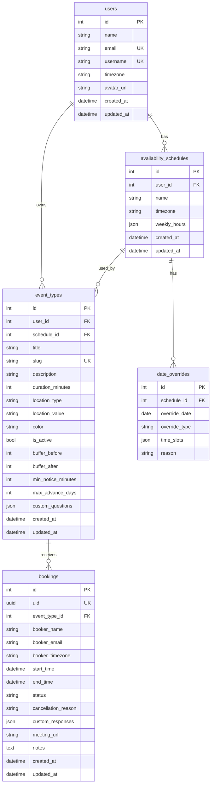

# Chroniq — Open-Source Scheduling Platform

> A full-featured Cal.com-inspired scheduling platform. Let anyone book time on your calendar with zero friction.

---

## Table of Contents

- [Overview](#overview)
- [Live Features](#live-features)
- [Architecture](#architecture)
- [Tech Stack & Rationale](#tech-stack--rationale)
- [Database Schema](#database-schema)
- [API Reference](#api-reference)
- [Local Development Setup](#local-development-setup)
- [Docker Setup (Recommended)](#docker-setup-recommended)
- [Environment Variables](#environment-variables)
- [Deployment Guide](#deployment-guide)
- [Project Structure](#project-structure)

---

## Overview

**Chroniq** is a production-ready, self-hosted scheduling platform inspired by Cal.com. Hosts define event types with customizable availability windows, buffer times, and booking questions. Guests book slots via a public link — the host's admin dashboard shows all bookings with full lifecycle management (reschedule, cancel, request-reschedule from client).

---

## Live Features

### Public Booking Flow
- ✅ Event type public page with host info, duration, location
- ✅ Interactive date picker + real-time slot availability
- ✅ Multi-timezone support (booker selects their timezone)
- ✅ Custom questions (text fields) per event type
- ✅ Booking confirmation page with meeting link
- ✅ Self-service reschedule & cancel via email links

### Admin Dashboard
- ✅ Event Type management (CRUD) with colors, buffers, custom questions
- ✅ Availability schedule (weekly hours + date overrides)
- ✅ Bookings list with tab filters: Upcoming / Past / Cancelled
- ✅ Live search & filter by name, email, event type
- ✅ Admin direct reschedule with slot picker
- ✅ Admin cancel with reason
- ✅ Send reschedule/cancel **request emails** to booker
- ✅ Recent bookings notification panel (auto-refreshes every 30s)
- ✅ Mobile + tablet responsive layout

### Email Notifications
- ✅ Booking confirmation (booker + host)
- ✅ Admin cancellation notification
- ✅ Admin reschedule notification (old → new time)
- ✅ Request-reschedule email (link for booker to pick new time)
- ✅ Request-cancel email (link for booker to confirm cancellation)

---

## Architecture

```
┌─────────────────────────────────────────────────────────────────────┐
│                          BROWSER / CLIENT                           │
│                                                                     │
│   ┌─────────────────────┐          ┌──────────────────────────┐    │
│   │  Admin Dashboard    │          │  Public Booking Pages    │    │
│   │  /event-types       │          │  /:username/:slug        │    │
│   │  /bookings          │          │  /booking/:uid           │    │
│   │  /availability      │          │  /booking/:uid/reschedule│    │
│   └──────────┬──────────┘          └────────────┬─────────────┘    │
│              │  React + React Router v7          │                  │
└──────────────┼──────────────────────────────────┼──────────────────┘
               │                                  │
               │  Axios HTTP  (/api/*)             │
               ▼                                  ▼
┌──────────────────────────────────────────────────────────────────────┐
│                     NGINX (Docker: port 80)                         │
│   • Serves React SPA static files                                   │
│   • Proxies /api/* ──────────────────────────────────────────────►  │
└──────────────────────────────────────────────────────────────────────┘
                                      │
                                      ▼
┌──────────────────────────────────────────────────────────────────────┐
│               FastAPI Backend (Docker: port 8000)                    │
│                                                                      │
│   ┌─────────────────────────────────────────────────────────────┐   │
│   │  Routers                                                    │   │
│   │  /api/event-types   /api/availability   /api/bookings       │   │
│   │  /api/public  (no-auth booking + reschedule + cancel)       │   │
│   └───────────────────────────┬─────────────────────────────────┘   │
│                               │                                      │
│   ┌───────────────────────────▼─────────────────────────────────┐   │
│   │  Service Layer                                              │   │
│   │  booking_service  •  availability_service  •  email_service │   │
│   └───────────────────────────┬─────────────────────────────────┘   │
│                               │  SQLAlchemy Async ORM               │
└───────────────────────────────┼──────────────────────────────────────┘
                                │
                                ▼
┌──────────────────────────────────────────────────────────────────────┐
│              PostgreSQL 16 (Docker: internal port 5432)              │
│   users  •  event_types  •  availability_schedules                  │
│   date_overrides  •  bookings                                        │
└──────────────────────────────────────────────────────────────────────┘
                                │
                                │  Background Tasks
                                ▼
                 ┌──────────────────────────────┐
                 │   SMTP Server (Gmail / etc.)  │
                 │   Jinja2 HTML email templates │
                 └──────────────────────────────┘
```

### Request Flow — Public Booking

```
Booker opens /:username/:slug
        │
        ▼
GET /api/public/:username/:slug         ← EventType details
        │
        ▼
GET /api/public/:username/:slug/slots   ← Available time slots
     (availability_service computes free slots respecting
      weekly schedule, date overrides, buffer times, conflicts)
        │
        ▼
POST /api/public/:username/:slug/book   ← Creates Booking row
     SELECT FOR UPDATE on EventType     ← Prevents double-booking
        │
        ├──► Background: send_booking_confirmation() email
        │
        ▼
Redirect → /booking/:uid  (Confirmation page)
```

---

## Tech Stack & Rationale

### Backend

| Technology | Version | Why we chose it |
|---|---|---|
| **FastAPI** | 0.115 | Async-first, auto-generates OpenAPI docs, Pydantic validation out of the box. Ideal for I/O-heavy scheduling APIs. |
| **SQLAlchemy (async)** | 2.0 | Mature ORM with async support via asyncpg. Type-safe mapped columns. |
| **asyncpg** | 0.31 | Fastest PostgreSQL driver for Python async. |
| **PostgreSQL 16** | – | ACID compliance essential for conflict-safe booking writes (`SELECT FOR UPDATE`). Advanced indexing on time ranges. |
| **Pydantic v2** | 2.13 | Request/response schema validation + settings management via `pydantic-settings`. |
| **aiosmtplib** | 3.0 | Non-blocking SMTP so email sending never blocks a request worker. |
| **Jinja2** | 3.1 | HTML email templates with dark-mode design. |
| **Uvicorn** | 0.34 | ASGI server with `--workers` for multi-core production. |

### Frontend

| Technology | Version | Why we chose it |
|---|---|---|
| **React 19** | 19.2 | Component model perfect for the multi-step booking flow. Concurrent features for smoother UX. |
| **Vite 8** | 8.0 | Sub-second HMR in dev. Tree-shaking + code splitting for lean bundles. |
| **React Router v7** | 7.15 | File-system-aware routing. Nested layouts for dashboard vs. public pages. |
| **Axios** | 1.16 | Interceptors for unified error handling. Easier than fetch for error messages from FastAPI. |
| **lucide-react** | 1.16 | Consistent icon set, tree-shakeable, SVG-based. |
| **react-hot-toast** | 2.6 | Zero-config toasts that match the dark design theme. |
| **Vanilla CSS** | – | Full control over the Cal.com-inspired dark design system. No utility-class bloat. CSS custom properties for theming. |

### Infrastructure

| Technology | Why |
|---|---|
| **Docker + Compose** | Reproducible environment on any machine. One command to start everything. |
| **nginx** | Serves static files (with aggressive caching), proxies `/api/*` to backend. Handles SPA client-side routing via `try_files`. |
| **GitHub Actions** (optional) | CI: lint, build, test before deploy. |

---

## Database Schema



**Booking `status` values:**
- `confirmed` — active booking
- `cancelled` — cancelled (by host or booker)

**Conflict prevention:** `SELECT FOR UPDATE` on `event_types` row during booking creation, plus overlap query on all event types for the host.

---

## API Reference

Base URL: `http://localhost:8000/api` (local) or `/api` (Docker via nginx)

Interactive docs: `http://localhost:8000/docs`

### Public (no auth)

| Method | Endpoint | Description |
|---|---|---|
| `GET` | `/public/:username/:slug` | Event type details |
| `GET` | `/public/:username/:slug/slots?date=&timezone=` | Available time slots |
| `POST` | `/public/:username/:slug/book` | Create booking |
| `GET` | `/public/booking/:uid` | Get booking by UID |
| `POST` | `/public/booking/:uid/cancel` | Booker cancels |
| `POST` | `/public/booking/:uid/reschedule` | Booker reschedules (in-place) |

### Admin (no auth in current build — add JWT for production)

| Method | Endpoint | Description |
|---|---|---|
| `GET` | `/bookings/?status=upcoming\|past\|cancelled` | List bookings |
| `GET` | `/bookings/recent?limit=5` | Recent bookings (notification bell) |
| `GET` | `/bookings/:uid` | Single booking |
| `PATCH` | `/bookings/:uid/cancel` | Admin cancel |
| `PATCH` | `/bookings/:uid/reschedule` | Admin reschedule (in-place) |
| `POST` | `/bookings/:uid/request-reschedule` | Email booker to reschedule |
| `POST` | `/bookings/:uid/request-cancel` | Email booker to cancel |
| `GET` | `/event-types/` | List event types |
| `POST` | `/event-types/` | Create event type |
| `PATCH` | `/event-types/:id` | Update event type |
| `DELETE` | `/event-types/:id` | Delete event type |
| `GET` | `/availability/` | Get availability schedule |
| `PUT` | `/availability/` | Update weekly hours |
| `GET` | `/availability/overrides` | List date overrides |
| `POST` | `/availability/overrides` | Add date override |
| `DELETE` | `/availability/overrides/:id` | Delete date override |

---

## Local Development Setup

### Prerequisites

- Python 3.12+
- Node.js 20+
- PostgreSQL 16 (local install or Docker for just the DB)

### 1 — Clone & set up

```bash
git clone https://github.com/yourname/chroniq.git
cd chroniq
```

### 2 — Backend

```bash
cd backend

# Create and activate virtual environment
python -m venv venv
source venv/bin/activate      # Windows: venv\Scripts\activate

# Install dependencies
pip install -r requirements.txt

# Configure environment
cp .env.example .env
# Edit .env: set DATABASE_URL, SMTP_*, FRONTEND_URL

# Start the API
uvicorn app.main:app --reload --port 8000
```

The API auto-creates database tables on startup.

To seed sample data (default user + event types):
```bash
python -m app.seed
```

### 3 — Frontend

```bash
cd frontend

# Install dependencies
npm install

# Start dev server
npm run dev
```

Open `http://localhost:5173` — the Vite proxy forwards `/api` calls to `localhost:8000`.

> **Note:** For local dev, add a Vite proxy in `vite.config.js` or make sure `VITE_API_URL` in `.env` points to `http://localhost:8000/api`.

---

## Docker Setup (Recommended)

### Prerequisites

- Docker Desktop 4.x+ (or Docker Engine + Compose v2)

### One-command start

```bash
# 1. Clone the repo
git clone https://github.com/yourname/chroniq.git
cd chroniq

# 2. Create your env file
cp .env.docker .env.docker.local
# Edit .env.docker.local — at minimum set SMTP_USER and SMTP_PASSWORD

# 3. Build and start all services
docker compose --env-file .env.docker.local up --build

# 4. (First run only) Seed default data
docker compose exec backend python -m app.seed
```

**Access:**
| Service | URL |
|---|---|
| App (nginx) | http://localhost |
| Backend API | http://localhost:8000 |
| API Docs | http://localhost:8000/docs |

### Useful commands

```bash
# View logs
docker compose logs -f

# Stop everything
docker compose down

# Stop and remove DB data (full reset)
docker compose down -v

# Rebuild only the frontend (e.g. after UI changes)
docker compose up --build frontend

# Open a backend shell
docker compose exec backend sh
```

---

## Environment Variables

| Variable | Default | Description |
|---|---|---|
| `DATABASE_URL` | `postgresql+asyncpg://...` | Full async PostgreSQL connection string |
| `POSTGRES_DB` | `chroniq` | Database name (Compose only) |
| `POSTGRES_USER` | `chroniq` | Database user (Compose only) |
| `POSTGRES_PASSWORD` | `chroniqsecret` | **Change in production** |
| `SMTP_HOST` | `smtp.gmail.com` | SMTP server |
| `SMTP_PORT` | `587` | SMTP port (587 = STARTTLS) |
| `SMTP_USER` | _(empty)_ | SMTP username — emails disabled if empty |
| `SMTP_PASSWORD` | _(empty)_ | SMTP password / app password |
| `SMTP_FROM_NAME` | `Chroniq` | Sender display name |
| `FRONTEND_URL` | `http://localhost` | Public URL (used in email links) |
| `DEFAULT_TIMEZONE` | `Asia/Kolkata` | Host's default timezone |
| `APP_NAME` | `Chroniq` | App name in emails |

### Gmail App Password setup

1. Enable 2FA on your Google account
2. Go to **Google Account → Security → App Passwords**
3. Generate a password for "Mail"
4. Set `SMTP_USER=you@gmail.com` and `SMTP_PASSWORD=<16-char-app-password>`

---

## Deployment Guide

### Option A — Railway (Easiest)

1. Push the repo to GitHub
2. Create a new Railway project → **Deploy from GitHub**
3. Add a **PostgreSQL** plugin
4. Set the backend service:
   - Root dir: `/backend`
   - Start command: `uvicorn app.main:app --host 0.0.0.0 --port $PORT`
   - Env vars: copy from `.env.docker`
5. Add a **Static Site** service for frontend:
   - Root dir: `/frontend`
   - Build: `npm run build`
   - Output: `dist`
   - Set `VITE_API_URL=https://your-backend.railway.app/api`

### Option B — Render

**Backend (Web Service):**
```
Root: backend/
Build: pip install -r requirements.txt
Start: uvicorn app.main:app --host 0.0.0.0 --port $PORT
```

**Frontend (Static Site):**
```
Root: frontend/
Build: npm ci && npm run build
Publish: dist/
Env: VITE_API_URL=https://your-backend.onrender.com/api
```

Add a **Render PostgreSQL** database and wire `DATABASE_URL`.

### Option C — VPS (Docker Compose in production)

```bash
# On your server (Ubuntu 22.04)
git clone https://github.com/yourname/chroniq.git
cd chroniq

# Fill in production secrets
cp .env.docker .env.prod
nano .env.prod   # Set POSTGRES_PASSWORD, SMTP_*, FRONTEND_URL=https://yourdomain.com

# Start
docker compose --env-file .env.prod up -d --build

# Point your domain's A record to the server IP
# Set up nginx/Caddy as reverse proxy for HTTPS (Certbot / Caddy auto-TLS)
```

**Caddy reverse proxy example** (install Caddy separately on the host):
```
yourdomain.com {
    reverse_proxy localhost:80
}
```

---

## Project Structure

```
chroniq/
├── backend/
│   ├── app/
│   │   ├── api/               # FastAPI routers
│   │   │   ├── bookings.py    # Admin booking endpoints
│   │   │   ├── public.py      # Public booking flow (no auth)
│   │   │   ├── event_types.py
│   │   │   └── availability.py
│   │   ├── email/
│   │   │   └── templates/     # Jinja2 HTML email templates
│   │   ├── models/            # SQLAlchemy ORM models
│   │   ├── schemas/           # Pydantic request/response schemas
│   │   ├── services/          # Business logic layer
│   │   │   ├── booking_service.py
│   │   │   ├── availability_service.py
│   │   │   └── email_service.py
│   │   ├── config.py          # Pydantic Settings
│   │   ├── database.py        # Async engine + session factory
│   │   ├── main.py            # FastAPI app + CORS + lifespan
│   │   ├── seed.py            # Default data seeder
│   │   └── utils.py
│   ├── Dockerfile
│   ├── requirements.txt
│   └── .env.example
│
├── frontend/
│   ├── src/
│   │   ├── api/               # Axios API calls
│   │   ├── components/
│   │   │   └── layout/        # Sidebar + DashboardLayout
│   │   ├── pages/
│   │   │   ├── dashboard/     # Admin pages (EventTypes, Bookings, Availability)
│   │   │   └── public/        # Public pages (BookingPage, ConfirmationPage, ...)
│   │   ├── utils/             # dateUtils, constants
│   │   ├── index.css          # Global dark design system (CSS custom properties)
│   │   └── App.jsx            # Route definitions
│   ├── Dockerfile
│   ├── nginx.conf             # SPA + API proxy config
│   └── package.json
│
├── docker-compose.yml
├── .env.docker                # Docker env template
├── .dockerignore
└── README.md
```

---

## Contributing

1. Fork the repo
2. Create a feature branch: `git checkout -b feat/your-feature`
3. Commit: `git commit -m 'feat: add your feature'`
4. Push and open a Pull Request

---

## License

MIT — use freely, attribution appreciated.
